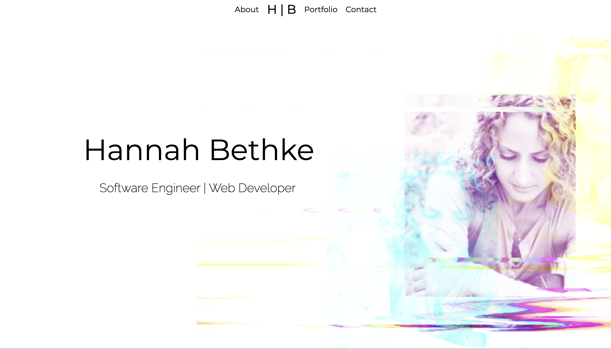

# Hannah Bethke
Software Engineering | Web Developer 

# Introducing Myself

# User Stories

- As a user, I am able to view Hannah Bethke's current portfolio, resume, and contact information

# Technologies Used

- HTML5
- CSS3
- Javascript
- Google Fonts
- Font Awesome
- Tailwind CSS
- AOS

# Screenshots

# Getting Started

[Click here](https://hannah-bethke.netlify.app/) to see the deployed app!

# Developer Enhancements

# TO DO
Homepage
- change nav font, weight?
- new color background?
- different text effect?
- off center positioning of text?
- new photo?
- change button color? **
- (make quirky version- "I make stuff...")
- tin foil hat, alien spaceship, stick or skeleton drinking martini

About Page
- write about me **
- change background color?

Portfolio
- write header p tag info
- change background color of scroll div?
- change background color of page?
- change color of buttons?

Contact 
- "Let's make stuff together..."
- change background color?

Add animated divs/text/pics?
Style for mobile/laptop

Write README

Get a domain?
Deploy
Make sure Tailwind still works after deployment
- try other installation methods?

Outcomes
- Create Git Hub profil

Known problems-
- Portfolio scroll bar does not show when you hover a mouse over it.  Only shows when using a track pad.
    - accessibility issue

